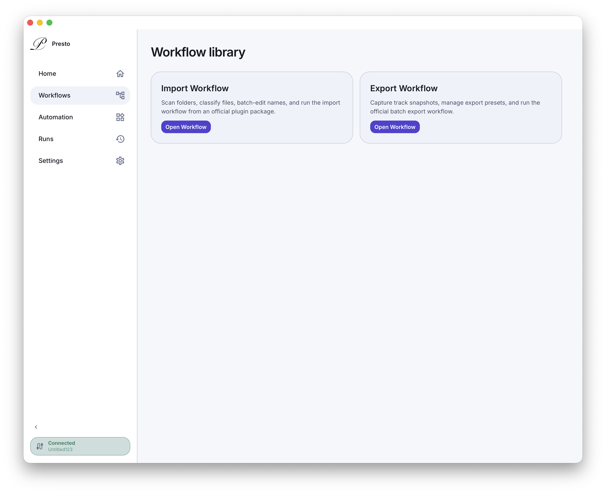
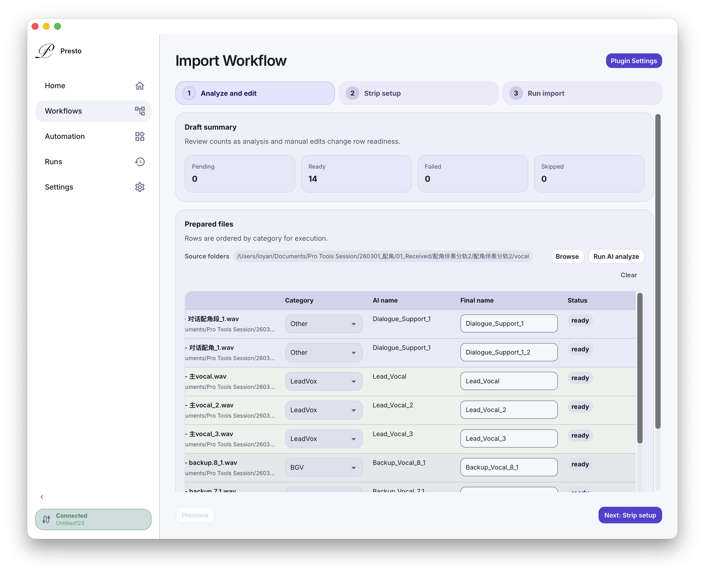
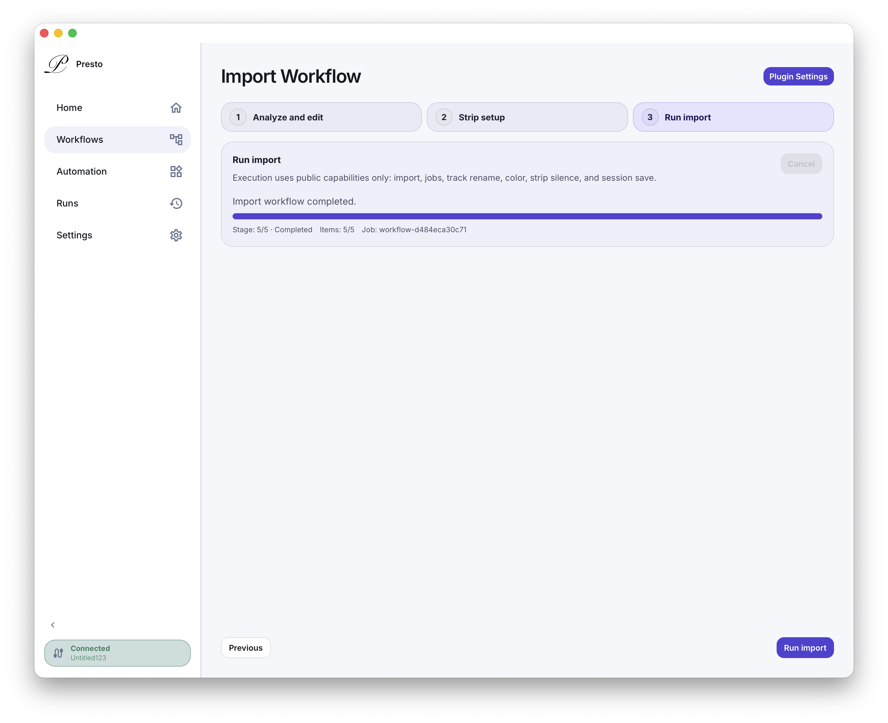

# Presto

Presto 是一个面向 DAW 工作流的 macOS 桌面应用。它把插件页面、workflow 入口和自动化执行收进同一个桌面工作区，让高频工程操作可以用更稳定、更清晰的方式重复执行；当前正式支持落地的 DAW 是 `Pro Tools`。

当前正式版本：`0.3.7`
发布说明：[docs/releases/v0.3.7-release.md](docs/releases/v0.3.7-release.md)

## 界面预览

下面三张预览图分别展示 workflow 入口、编辑界面和执行结果。

<table>
  <tr>
    <td align="center" width="33.33%">
      <strong>Workflow Library</strong><br />
      
    </td>
    <td align="center" width="33.33%">
      <strong>Analyze And Edit</strong><br />
      
    </td>
    <td align="center" width="33.33%">
      <strong>Run Import</strong><br />
      
    </td>
  </tr>
</table>

## 当前支持

- 平台：`macOS`
- 产品定位：面向 DAW 工作流的桌面宿主
- 当前唯一正式支持并已落地的 DAW：`Pro Tools`
- 当前版本支持在桌面宿主里加载插件页面、执行 workflow 和调用自动化相关能力
- 自动化相关能力依赖 macOS 辅助功能权限

## 安装与启动

如果你使用当前发布产物，请按下面的路径安装：

1. 准备与当前 Mac 芯片架构匹配的 `Presto` 安装包。
2. 将 `Presto.app` 拖到 `Applications`。
3. 从 `/Applications/Presto.app` 启动应用。
4. 首次打开如果被系统拦截，按住 `Control` 键点按应用，选择“打开”。

如果系统仍然阻止打开：

1. 打开“系统设置 -> 隐私与安全性”。
2. 在底部找到刚刚被拦截的 `Presto`。
3. 点“仍要打开”。

## macOS 辅助功能权限

Presto 的自动化相关能力依赖 macOS 辅助功能权限。首次启动后，如果应用提示需要授权，请按下面处理：

1. 打开“系统设置 -> 隐私与安全性 -> 辅助功能”。
2. 为 `Presto` 打开权限。
3. 如果已经授权但仍然失败，先移除再重新添加，然后重新打开应用。
4. 优先从 `/Applications/Presto.app` 启动正式安装包。

## 从源码运行

如果你是在本地开发或验证当前版本，可以直接从源码启动：

```bash
npm install
npm run tauri:dev
```

运行测试：

```bash
npm test
```

如果你需要本地打包当前桌面应用：

```bash
npm run tauri:build
```

## 文档

根 README 只保留产品与安装入口。更完整的开发文档请从这里继续：

- [文档总索引](docs/README.md)
- [内核开发文档](docs/kernel-development/README.md)
- [插件开发与规范](docs/plugin-development/README.md)

## 捐赠

如果这个项目对你有帮助，可以扫码支持：

<table>
  <tr>
    <td align="center" width="50%">
      <br />
      微信
    </td>
    <td align="center" width="50%">
      <br />
      支付宝
    </td>
  </tr>
</table>
